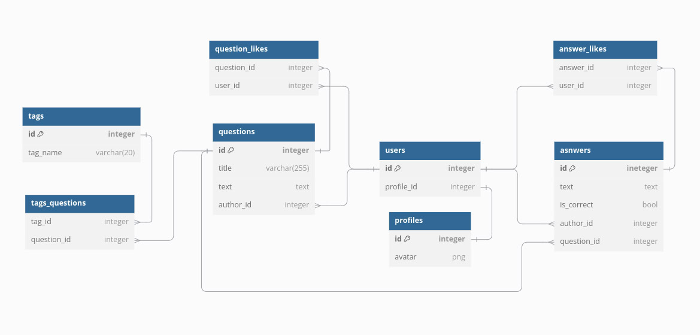

# Ссылки на HTML-файлы для проверки ДЗ 1

- [questionsListing.html](https://kms-qwe.github.io/TP_WT/AnswerHub/templates/questionsListing.html)
- [newQuestion.html](https://kms-qwe.github.io/TP_WT/AnswerHub/templates/newQuestion.html)
- [questionPage.html](https://kms-qwe.github.io/TP_WT/AnswerHub/templates/questionPage.html)
- [tagQuestionsListing.html](https://kms-qwe.github.io/TP_WT/AnswerHub/templates/tagQuestionsListing.html)
- [userPage.html](https://kms-qwe.github.io/TP_WT/AnswerHub/templates/userPage.html)
- [logInPage.html](https://kms-qwe.github.io/TP_WT/AnswerHub/templates/logInPage.html)
- [registration.html](https://kms-qwe.github.io/TP_WT/AnswerHub/templates/registration.html)

# Схема БД для проверки ДЗ 3

# Бенчмарки для проверки ДЗ 6

## 1. Отдача статического документа напрямую через Nginx

- **Server Software**: nginx/1.24.0
- **Server Hostname**: localhost
- **Server Port**: 80
- **Document Path**: /static/img/cat.png
- **Document Length**: 4400140 bytes

### Результаты:
- **Concurrency Level**: 10
- **Time taken for tests**: 0.716 seconds
- **Complete requests**: 1000
- **Failed requests**: 0
- **Total transferred**: 4400486000 bytes
- **HTML transferred**: 4400140000 bytes
- **Requests per second**: 1396.58 [#/sec] (mean)
- **Time per request**: 7.160 [ms] (mean)
- **Transfer rate**: 6001608.32 [Kbytes/sec] received

### Connection Times (ms)
| Connect | Processing | Waiting | Total |
|---------|------------|---------|-------|
| 0       | 7          | 0       | 7     |

### Percentage of requests served within a certain time (ms)
| Time (ms) | Percentage |
|-----------|------------|
| 50%       | 7          |
| 66%       | 7          |
| 75%       | 7          |
| 80%       | 7          |
| 90%       | 8          |
| 95%       | 8          |
| 98%       | 9          |
| 99%       | 9          |
| 100%      | 9          |

---

## 2. Отдача статического документа напрямую через Gunicorn

- **Server Software**: gunicorn
- **Server Hostname**: localhost
- **Server Port**: 8000
- **Document Path**: /static/img/cat.png
- **Document Length**: 4400140 bytes

### Результаты:
- **Concurrency Level**: 10
- **Time taken for tests**: 0.742 seconds
- **Complete requests**: 1000
- **Failed requests**: 0
- **Total transferred**: 4400505000 bytes
- **HTML transferred**: 4400140000 bytes
- **Requests per second**: 1346.82 [#/sec] (mean)
- **Time per request**: 7.425 [ms] (mean)
- **Transfer rate**: 5787786.98 [Kbytes/sec] received

### Connection Times (ms)
| Connect | Processing | Waiting | Total |
|---------|------------|---------|-------|
| 0       | 7          | 6       | 7     |

### Percentage of requests served within a certain time (ms)
| Time (ms) | Percentage |
|-----------|------------|
| 50%       | 7          |
| 66%       | 7          |
| 75%       | 7          |
| 80%       | 7          |
| 90%       | 9          |
| 95%       | 11         |
| 98%       | 11         |
| 99%       | 19         |
| 100%      | 21         |

---

## 3. Отдача динамического документа напрямую через Gunicorn

- **Server Software**: gunicorn
- **Server Hostname**: localhost
- **Server Port**: 8000
- **Document Path**: /question/147023/
- **Document Length**: 7382 bytes

### Результаты:
- **Concurrency Level**: 10
- **Time taken for tests**: 15.091 seconds
- **Complete requests**: 1000
- **Failed requests**: 0
- **Total transferred**: 7678000 bytes
- **HTML transferred**: 7382000 bytes
- **Requests per second**: 66.27 [#/sec] (mean)
- **Time per request**: 150.909 [ms] (mean)
- **Transfer rate**: 496.86 [Kbytes/sec] received

### Connection Times (ms)
| Connect | Processing | Waiting | Total |
|---------|------------|---------|-------|
| 0       | 150        | 150     | 150   |

### Percentage of requests served within a certain time (ms)
| Time (ms) | Percentage |
|-----------|------------|
| 50%       | 151        |
| 66%       | 152        |
| 75%       | 152        |
| 80%       | 152        |
| 90%       | 153        |
| 95%       | 153        |
| 98%       | 155        |
| 99%       | 159        |
| 100%      | 162        |

---

## 4. Отдача динамического документа через проксирование запроса с Nginx на Gunicorn

- **Server Software**: nginx/1.24.0
- **Server Hostname**: localhost
- **Server Port**: 80
- **Document Path**: /question/147023/
- **Document Length**: 7382 bytes

### Результаты:
- **Concurrency Level**: 10
- **Time taken for tests**: 8.380 seconds
- **Complete requests**: 1000
- **Failed requests**: 0
- **Total transferred**: 7691000 bytes
- **HTML transferred**: 7382000 bytes
- **Requests per second**: 119.33 [#/sec] (mean)
- **Time per request**: 83.799 [ms] (mean)
- **Transfer rate**: 896.28 [Kbytes/sec] received

### Connection Times (ms)
| Connect | Processing | Waiting | Total |
|---------|------------|---------|-------|
| 0       | 83         | 83      | 83    |

### Percentage of requests served within a certain time (ms)
| Time (ms) | Percentage |
|-----------|------------|
| 50%       | 82         |
| 66%       | 83         |
| 75%       | 83         |
| 80%       | 84         |
| 90%       | 90         |
| 95%       | 95         |
| 98%       | 101        |
| 99%       | 105        |
| 100%      | 109        |

---

## 5. Отдача динамического документа через проксирование запроса с Nginx на Gunicorn с кэшированием на Nginx (Proxy Cache)

- **Server Software**: nginx/1.24.0
- **Server Hostname**: localhost
- **Server Port**: 80
- **Document Path**: /question/147023/
- **Document Length**: 7382 bytes

### Результаты:
- **Concurrency Level**: 10
- **Time taken for tests**: 0.123 seconds
- **Complete requests**: 1000
- **Failed requests**: 0
- **Total transferred**: 7691000 bytes
- **HTML transferred**: 7382000 bytes
- **Requests per second**: 8101.36 [#/sec] (mean)
- **Time per request**: 1.234 [ms] (mean)
- **Transfer rate**: 60847.26 [Kbytes/sec] received

### Connection Times (ms)
| Connect | Processing | Waiting | Total |
|---------|------------|---------|-------|
| 0       | 1          | 1       | 1     |

### Percentage of requests served within a certain time (ms)
| Time (ms) | Percentage |
|-----------|------------|
| 50%       | 0          |
| 66%       | 0          |
| 75%       | 0          |
| 80%       | 0          |
| 90%       | 0          |
| 95%       | 0          |
| 98%       | 1          |
| 99%       | 19         |
| 100%      | 103        |

Вот исправленный текст с правильными ссылками:

---

# Домашнее задание №7

## Real-time сообщения

### Настройка Centrifugo
- Конфигурация Centrifugo: [centrifugo/centrifugo_config.json](https://github.com/kms-qwe/TP_WT/blob/main/AnswerHub/centrifugo/centrifugo_config.json)
- Обработка на бэкенде:
  - `get_centrifugo_data`: [app/views.py#L28](https://github.com/kms-qwe/TP_WT/blob/main/AnswerHub/app/views.py#L28)
  - `client`: [app/views.py#L26](https://github.com/kms-qwe/TP_WT/blob/main/AnswerHub/app/views.py#L26)
  - `question`: [app/views.py#L134](https://github.com/kms-qwe/TP_WT/blob/main/AnswerHub/app/views.py#L134)
- Обработка на фронтенде:
  - [templates/questionPage.html#L47](https://github.com/kms-qwe/TP_WT/blob/main/AnswerHub/templates/questionPage.html#L47)

---

## Кэширование
- Методы кэширования в бэкенде:
  - `get_popular_tags`: [app/views.py#L41](https://github.com/kms-qwe/TP_WT/blob/main/AnswerHub/app/views.py#L41)
  - `set_cache_tags`: [app/views.py#L46](https://github.com/kms-qwe/TP_WT/blob/main/AnswerHub/app/views.py#L46)
  - `get_best_users`: [app/views.py#L65](https://github.com/kms-qwe/TP_WT/blob/main/AnswerHub/app/views.py#L65)
  - `set_cache_users`: [app/views.py#L70](https://github.com/kms-qwe/TP_WT/blob/main/AnswerHub/app/views.py#L70)
- Шаблоны:
  - [templates/layout/base.html#L121](https://github.com/kms-qwe/TP_WT/blob/main/AnswerHub/templates/layout/base.html#L121)
- Скрипт заполнения кэша:
  - [app/managment/commands/fill_cache.py](https://github.com/kms-qwe/TP_WT/blob/main/AnswerHub/app/management/commands/fill_cache.py)
- Запуск CRON:
  - \* \* \* \* \* cd /path/to/project && /bin/bash -c "source venv/bin/activate && /path/to/project/venv/bin/python manage.py fill_cache" >> /path/to/project/cron_log.txt 2>&1

---

## Полнотекстовый поиск
- Определение модели:
  - [app/models.py#L70](https://github.com/kms-qwe/TP_WT/blob/main/AnswerHub/app/models.py#L70)
- URL маршруты:
  - [app/urls.py#L25](https://github.com/kms-qwe/TP_WT/blob/main/AnswerHub/app/urls.py#L25)
- Миграция:
  - [app/migrations/0004_remove_question_question_search_vector_gin.py](https://github.com/kms-qwe/TP_WT/blob/main/AnswerHub/app/migrations/0004_remove_question_question_search_vector_gin.py)
- Шаблоны:
  - [templates/layout/base.html#L20](https://github.com/kms-qwe/TP_WT/blob/main/AnswerHub/templates/layout/base.html#L20)

--- 

